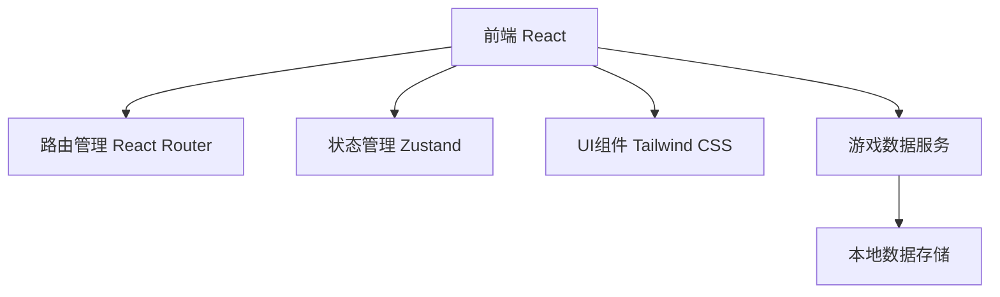

# 100个亲子游戏 - 技术架构文档

## 1. Architecture Design



## 2. Technology Description
- 前端：React@18 + TypeScript + Tailwind CSS + Vite
- 初始化工具：vite-init
- 后端：无（纯前端应用）
- 数据存储：localStorage（用于收藏功能）
- 状态管理：Zustand
- 路由：React Router DOM

## 3. Route Definitions
| Route | Purpose |
|-------|---------|
| / | 首页 |
| /games | 游戏列表页 |
| /games/:id | 游戏详情页 |
| /favorites | 收藏页面 |

## 4. Data Model

### 4.1 Game Data Structure
```typescript
interface Game {
  id: number;
  title: string;
  category: string;
  ageRange: string;
  duration: string;
  difficulty: 'easy' | 'medium' | 'hard';
  description: string;
  materials: string[];
  steps: string[];
  image: string;
  benefits: string[];
}
```

### 4.2 Categories
- 创造力游戏
- 运动游戏
- 智力游戏
- 协作游戏
- 艺术游戏
- 科学探索
- 户外游戏
- 室内游戏

### 4.3 Game Data Initialization
100个游戏将被分为8个分类，每个分类包含12-13个游戏，覆盖3-12岁年龄段，难度从简单到困难。

## 5. File Structure
```
/workspace
├── src/
│   ├── components/
│   │   ├── GameCard.tsx
│   │   ├── GameCategory.tsx
│   │   ├── Header.tsx
│   │   └── Footer.tsx
│   ├── pages/
│   │   ├── Home.tsx
│   │   ├── GameList.tsx
│   │   ├── GameDetail.tsx
│   │   └── Favorites.tsx
│   ├── data/
│   │   └── games.ts
│   ├── store/
│   │   └── useGameStore.ts
│   ├── App.tsx
│   └── main.tsx
├── package.json
├── tailwind.config.js
└── vite.config.ts
```

## 6. State Management
使用Zustand管理游戏数据和收藏状态：
```typescript
import { create } from 'zustand';

interface GameState {
  games: Game[];
  favorites: number[];
  toggleFavorite: (gameId: number) => void;
  isFavorite: (gameId: number) => boolean;
}
```

## 7. Key Implementation Notes
- 响应式设计，支持移动端、平板和桌面端
- 使用本地存储持久化收藏列表
- 图片使用稳定的CDN资源
- 流畅的页面过渡动画
- 语义化HTML，良好的可访问性
