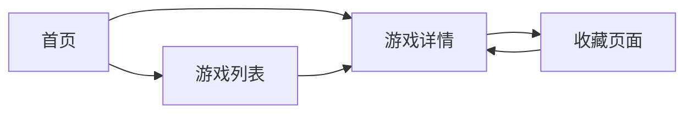

# 100个亲子游戏 - 产品需求文档

## 1. Product Overview
这是一个包含100个精心设计的亲子游戏的网站，为家长和孩子提供有趣、有教育意义的互动体验。
- 目标用户：有3-12岁孩子的家庭
- 市场价值：促进亲子关系，提供结构化的游戏资源，支持儿童全面发展

## 2. Core Features

### 2.1 User Roles
| Role | Registration Method | Core Permissions |
|------|---------------------|------------------|
| 普通用户 | 无需注册 | 浏览所有游戏，查看游戏详情，收藏游戏 |

### 2.2 Feature Module
1. **首页**：游戏分类导航、热门游戏推荐、游戏搜索
2. **游戏列表页**：按分类展示所有游戏，筛选和排序
3. **游戏详情页**：游戏说明、步骤、材料准备、游戏时长、难度等级
4. **收藏页面**：用户收藏的游戏列表

### 2.3 Page Details
| Page Name | Module Name | Feature description |
|-----------|-------------|---------------------|
| 首页 | 导航栏 | 品牌标识、分类导航、搜索框 |
| 首页 | Hero区域 | 欢迎信息、核心价值主张、吸引眼球的视觉设计 |
| 首页 | 游戏分类 | 按年龄段、游戏类型、难度等分类展示 |
| 首页 | 热门推荐 | 精选游戏卡片展示 |
| 游戏列表页 | 筛选功能 | 按分类、年龄段、难度筛选游戏 |
| 游戏列表页 | 游戏卡片 | 展示游戏预览图、标题、简短描述 |
| 游戏详情页 | 游戏信息 | 游戏名称、分类、适合年龄、时长、难度 |
| 游戏详情页 | 游戏说明 | 详细的游戏介绍和教育意义 |
| 游戏详情页 | 材料准备 | 列出所需材料清单 |
| 游戏详情页 | 游戏步骤 | 清晰的步骤说明，配有图片/图标 |
| 收藏页面 | 收藏列表 | 展示用户收藏的游戏，支持删除 |

## 3. Core Process
用户访问网站 → 浏览首页推荐和分类 → 选择感兴趣的游戏 → 查看游戏详情 → 按照说明进行游戏 → 收藏喜欢的游戏以便日后使用

## 4. User Interface Design
### 4.1 Design Style
- **主色调**：温暖的橙色系（#FF8C00）作为主色，传达活力和快乐；搭配柔和的蓝色（#4A90E2）作为辅助色，体现信任和教育
- **按钮风格**：圆角按钮，带有轻微的阴影和悬停动画效果
- **字体**：使用Poppins作为标题字体，Nunito作为正文字体，营造友好活泼的氛围
- **布局风格**：卡片式布局，充分利用白色空间，色彩明快
- **图标风格**：使用活泼的线性图标，带有适当的颜色填充

### 4.2 Page Design Overview
| Page Name | Module Name | UI Elements |
|-----------|-------------|-------------|
| 首页 | Hero区域 | 渐变背景、大标题、副标题、CTA按钮、平滑动画 |
| 首页 | 游戏分类 | 彩色分类卡片、图标、悬停效果 |
| 首页 | 热门推荐 | 游戏卡片网格、预览图、评分、收藏按钮 |
| 游戏详情页 | 游戏信息 | 顶部大图、信息标签、清晰的内容分区 |
| 游戏详情页 | 步骤说明 | 编号列表、图标、渐变色块分隔 |

### 4.3 Responsiveness
- 桌面端优先设计，完全适配移动端和平板设备
- 响应式网格布局，根据屏幕尺寸自动调整列数
- 触摸优化的按钮和交互元素，确保在移动设备上的良好体验

### 4.4 视觉细节
- 使用柔和的圆角和阴影创造友好感
- 添加微妙的渐变和纹理增强视觉层次
- 统一的间距和色彩系统，保持整体设计一致性
